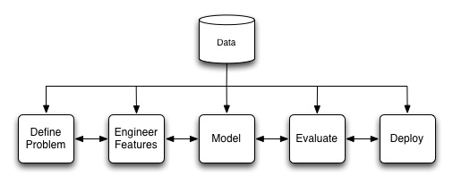

# Pratical Machine Learning for Network Security

## Abstract

Machine learning is currently receiving a lot of attention in network security.  There are many start-ups and existing companies that claim they use it in their solutions; yet, few details are shared on why or how it works.  So, is machine learning a potential solution or all hype?  The answer depends on the problem.

In this paper we will demonstrate how machine learning can be leveraged to solve a set of practical network security problems.  However, we will also discuss its limitations and show how it can fail.  The focus of the paper will be on applying both supervised and unsupervised learning to problems in network security.  Case studies of real machine learning systems will be used to illustrate some of the issues faced by practitioners and provide practical techniques that can be used to mitigate many of them.

## Introduction

Machine learning is a useful tool for a subset of the problems in network security, but it is often overhyped with a focus on the math behind it.  This limits the audience that can fully understand how it works and assess its limitations.  However, the math is just one aspect and typically not the most important for evaluating a project, product or idea.  In this paper, we examine all stages of a machine-leaning project with a focus on application (see Figure).

## Data

Data are the foundation of all machine-learning projects.  You can have an expert data science team and execute the machine-learning process flawlessly, but still have the project fail due to wrong or insufficient data.  Data should be viewed as an asset and investments should be made as part of the project.   

## Define Problem

Defining the problem is typically the first step.  For our two case studies our high level problem is to "detect hosts infected with malware by observing their network communication."  This, however, is not a well-defined machine-learning problem.  To formulate a machine-learning problem we must define the following components:  task, training experience and performance measurement [4]. 

**C&C Protocol Detection (Case Study)[^3]**  One way to detect infected hosts is to recognize the structure of known C&C communication.  The communication structure for a malware family tends to not change as rapidly as its executable files, domains and IP-addresses because it is not as easy to update.  Using this observation we define the problem as follows:

- **Task:** recognize and attribute C&C communication on live networks.
- **Training experience:** packet captures of labeled C&C communication.   
- **Performance measurement:** percentage of network communication correctly classified.    

**DGA Detection (Case Study)[^2].** Malware using a domain-generation-algorithm (DGA) to locate their C&C-server can be detected by observing their NXDomains.  DGAs often generate hundreds of domains per-day; however, only a few are registered (NXDomains are failed DNS lookups).  Hosts infected by the same malware tend to generate overlapping sets of NXDomains and domains generated by the same DGA share structural similarities.  We define the problem as follows:

- **Task:** recognizing and attributing sets of NXDomains to a DGA.
- **Training experience:** labeled sets of NXDomains generated by malware.
- **Performance measurement:** percentage of NXDomains correctly classified.    

## Engineer Features

Engineering features is where the majority of the time is spent on most machine-learning projects.  It is critical to its success and is where domain knowledge, intuition and creativity are extremely important.  For classification, the goal is to identify attributes that can be used to predict the group a new observation belongs.  Feature engineering for a network security is often harder than many other domains because an adversary may actively attempt to bypass the system; thus, ease of evasion should be considered when identifying features.  

Typically the first step is to preprocess the collected data to clean and integrate it.  Raw data rarely makes for good features; instead the features are usually measurements calculated on the preprocessed data.  For C&C protocol detection, we generalize the data first by replacing the actual strings with their data types and lengths.  For our features we perform measurements on the following:

- Parameter names.
- Data types and lengths for the parameter values.
- Data types and lengths from the path.
- Presence and order of the headers.
- Data types and lengths of header values. 
- Server network address.

For example, one of the features is calculated by measuring the difference in the parameter names of request pairs using Jaccard Index.

For DGA detection, the features are measurements on the following:

- n-gram for n={1,2,3,4}.
- Entropy of the character distribution.
- Structural features such as the length and number of domain levels.
- Set of NXDomains contacted by each host. 

For instance, features derived from n-gram calculations include the mean, median and standard deviation of the character distributions. 

An important aspect of feature engineering is determining the features that are important for prediction.  Most of the time only a subset of the ones identified using domain knowledge or intuition are useful because they are either redundant or not a predictor.  Removing these unhelpful features often improves the model's ability to generalize to new data.  Important features can be identified by [^1]:

- Try all combination of features and keep the smallest set that performs well.  If the number of features is small this is the optimal technique (feature sets grow at 2n).
- Forward selection.  Start with no features.  Then try n models each using a single feature.  Keep the feature for the model that performed the best.  Next try n - 1 models using the combination of the feature from the previous step and the remaining features.  Continue until the model stops improving or there are no more features to add.  Keep the smallest feature set that performs well.  
- Backwards selection.   Basically the opposite of forward selection.  Start with all n features.  Next try n models by removing a different single feature each time.  Continue until the model no longer performs well.  Keep the smallest feature set that performs well. 

## Model

Modeling is where the learning actually happens.  There are two type of learning commonly used:  supervised and unsupervised [^5].  In supervised learning, the data are labeled so we know the correct output for each example.  Unsupervised learning does not have labeled data.  Instead it is used to find group (clusters) of examples that may be related.  

For C&C protocol detection, we use unsupervised learning to group HTTP requests generated by malware.  Requests that share a similar protocol structure are placed in the same cluster.  Not all clusters represent C&C communication.  For example, malware often contacts benign domains to verify network connectivity before contacting their C&C server.  Therefore, we label each cluster as C&C/malware-family or not-C&C.  Part of the labeling can be done automatically using the domains in the cluster (e.g., a known C&C domain).  The remaining unlabeled clusters are reviewed manually by examining a sample of the requests.

Once the C&C clusters are identified we locate the center of each one and extract its values.  We call these "control protocol templates" (CPTs) because they represent the structure of the C&C protocol for each cluster's malware family (CPTs are what we learn).  CPTs can be deployed on a live network and compared to observed communication to identify infected hosts. 

For DGA detection, we cluster using two different methods.  First we cluster using the name features (n-gram, entropy, structural).  Then we separately cluster using the sets of NXDomains generated by hosts.  Individually both sets of clusters contain a lot of noise.  However, we pairwise compare clusters from both groups by measuring their set intersection.  If it exceeds a predefined threshold we combine the clusters.  If a cluster does not have a high enough intersection with a cluster from the other group it is discarded.

Each DGA cluster is manually reviewed to determine if malware generated the NXDomains and, if it is malware, label it with the malware family.  These labeled clusters are then used as training data for supervised learning.  The resulting model can classify newly observed NXDomains as a specific malware family, benign or unknown.

## Evaluate

Once a model has been created it should be evaluated.  It is important to use data not in the training set because the goal is not memorization, but classification of new, never before seen observations (i.e., generalization).  A commonly used technique is 10-fold cross validation.  The data is separated into 10 equal segments with 9 used for training and 1 for evaluation.  This is repeated 10 times using a different segment for the training set each time.  The performance of the classifier is the average of the 10 iterations.

## Deploy

Deployment is the final step, but typically not the end of the project.  Both the C&C protocol and DGA detection projects have been deployed in commercial security products.  New CPTs are generated for C&C communication when it is identified using anther technique (e.g., DGA, manual review, domain reputation) and new DGAs are discovered through review of NXDomain clusters that do not belong to a known malware family.  So, the learning continues even after deployment. 

## Conclusion

Machine learning is a useful tool that can be successfully applied to a subset of problems in network security.  However, it should only be viewed as a tool not a solution.  Just because a security product uses cutting edge math or machine-learning algorithm does not imply that it will actually enhance security.  Instead of focusing on the math, ask about the features and data the product uses because those answers will allow you determine its usefulness. 

## References

* [^1] Gareth James, Daniela Witten, Trevor Hastie, Rovert Tibshirani, An Introduction to Statistical Learning.  Springer.
* [^2] Manos Antonakakis, Roberto Perdisci, Yacin Nadji, Nikolaos Vasiloglou, Saeed Abu-Nimeh, Wenke Lee, and David Dagon. 2012. From throw-away traffic to bots: detecting the rise of DGA-based malware. USENIX conference on Security (SEC'12). 
* [^3] Terry Nelms, Roberto Perdisci, and Mustaque Ahamad. 2013. ExecScent: mining for new C&C domains in live networks with adaptive control protocol templates.  USENIX conference on Security (SEC'13). 
* [^4] Thomas M. Mitchell. 1997. Machine Learning. McGraw-Hill.
* [^5] Yaser S. Abu-Mostafa, Malik Magdon-Ismail, Hsuan-Tien Lin.  Learning from Data.  AMLbook.com. 

#### Metadata

Tags: machine learning, network security, botnet 

**Primary Author Name**: Terry Nelms  
**Primary Author Affilication**: Damballa, Inc.  
**Primary Author Email**: tnelms@damballa.com
