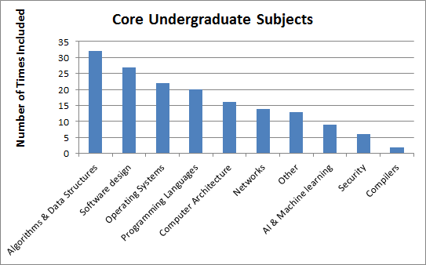
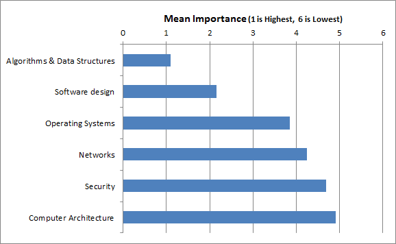
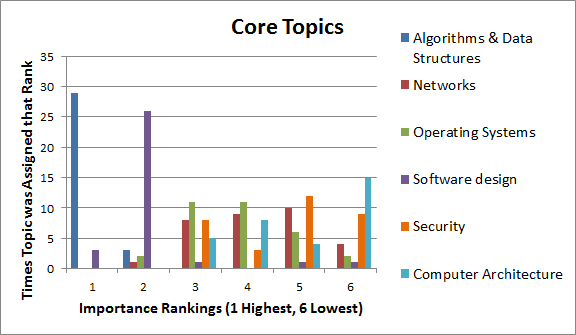
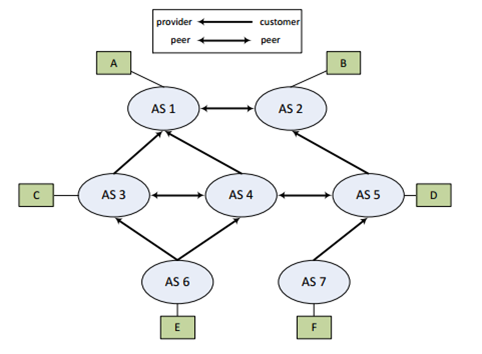
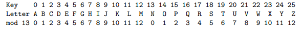

# Rethinking the Role of Security in Undergraduate Education

Abstract: 

The role of security in computer science education needs to be reconsidered.  There is little to no applied security content for the majority of undergraduate computer science students. Given that security is an afterthought in education, it should be no surprise that it ends up being an afterthought when those students join the working world.  As a result, the same security mistakes are made over and over again.  

Most security content in curriculum today is meant for future security specialists. What content there is comes as a standalone class or lecture, and is not interwoven with regular curricula.   

The integration of Environmental Engineering design concepts into general engineering curricula provides a model for how to fix this ìafterthoughtî problem.  Applied security content needs to be integrated throughout the undergraduate computer science curriculum.  This can be achieved with minimal disruption to the existing courses, as long as the changes are subtle, but consistent. 

#Rethinking the Role of Security in Undergraduate Education# 

# INTRODUCTION

We all know that thereís an inherent asymmetry in computer security that favors the attacker.  The offense only needs one successful exploit in order to win, while the defense has a huge amount of surface area that they needs to guard.  This asymmetry may be unavoidable, but it is unnecessarily amplified by how we approach computer security.  The offense gets to focus on finding bugs and exploiting them, while the defense has to spend the majority of their time fixing mistakes that shouldnít have happened in the first place.  Some amount of bugs are inevitable, but most of the major security problems today occur because programmers donít have even a baseline understanding of security, and security isnít a part of their design process.  I call this the security afterthought problem.  Even as security becomes a higher priority in peopleís rhetoric, it remains an afterthought in their work and their design processes.  

Too often someone designs a system without security in mind, and then later has to come up with awkward and imperfect fixes for security flaws that could have been avoidable.  This "security as an afterthought" approach is, however, a natural result of the way in which security is currently taught.  Computer scientists have a tendency to treat security as a separate topic, leaving it for an advanced class that interested seniors or graduate students might choose to take as an elective.  Security is an integral facet of just about every topic in computer science.  However, it is too easy for an undergraduate to gain a computer science degree without ever learning about the security concepts relevant to their specialty.  

Rather than treating security as an afterthought, something that is addressed after all the foundations are fully in place, it should be treated as an integral part of networking, programming languages, operating systems, and every other computer science discipline.  The way a subject is initially taught will always influence how the student thinks about it, so even introductory courses need applied security content.  

There has been a major push to develop specialized security content geared towards training future security experts.  That is important, valuable work, but we need to remember that all computer science students need to learn at least the security basics of their chosen fields.  We should not forget one need in our rush to address the other .  

<A HREF="#section2">Section 2</A> presents some data regarding securityís current visibility in general undergraduate curriculum, and the degree to which it is integrated into core classes.  Then in <A HREF="#section3">Section 3</A>  Environmental Engineering and its integration into general engineering curriculum is used as an exemplar from which to model computer security integration into computer science.  This section also addresses some simple changes which could be made to computer science accreditation requirements, in order to ensure that they meet the same standards as those in engineering.  <A HREF="#section4">Section 4</A> lays out general goals for computer science curricula in the future, and simple, actionable ways to achieve those goals.  <A HREF="#section5">Section 5</A> discusses overall goals for undergraduate curriculum design and the next steps towards achieving these goals.   

# 2\. SECURITY IN TODAYíS CURRICULA #

A survey was sent to 100 university computer science department heads, and 33 responded with data about their undergraduate curricula.  The survey was designed to determine to what degree security is prioritized and integrated in undergraduate core curricula, as well as how applied that content is.   

## 2\.1 Priority in Comparison to Other Subjects##

Securityís ranking as a topic in overall curriculum design was ascertained using two different questions.  First, the professors were presented with 10 core curriculum subjects, and asked to pick the 5 which were most important to include in undergraduate curriculum.  

As the graph in Figure 1 shows, Security was included in 6 of the 33 responses, making it ranked 9th out of 10, with only Compilers getting a lower inclusion rate.  

The other approach to this question was to present the professors with 6 computer science subjects, and ask them to rank them from most to least important.  

Figure 2 shows that when the ranks assigned to each subject were averaged, security has a mean ranking of 4.7, making it the 5th of 6 subjects.  

__Figure 1. Security inclusion as a core subject.__
 

 

__Figure 2. Mean security ranking out of 6 subjects.__

## 2\.2 Integration into Other Subjects ##

Clearly, when security is made a separate subject, it is not highly prioritized in the overall curriculum design.  Security does not have to be a separate topic, of course.  It is an integral facet of all other computing subjects, and could be treated as such.  This leads to the question, how integrated is security in the core curriculum?

Professors were asked to rate their curriculum in terms of how separate or integrated security is in the introductory courses, with 1 meaning completely separate, and 5 being totally integrated.  
 
 

__Figure 3. Integration of Security into Curriculum.__

Figure 3 shows that security is almost always treated as a separate topic, with only 6 universities saying that it was completely or mostly integrated, while 22 said that it was completely or mostly separate.  

This data becomes even more telling after factoring in how applied that security content is.  Professors were asked to say how applied their content was for several subjects.  Figure 4 shows those ratings for security plotted against the integration ratings.  The applied vs theoretical ratings tended to be moderate, with very few 1ís or 5ís. Even so the data shows a very clear trend of security content becoming less applied as it becomes more integrated. 

 

__Figure 4. Security content becomes more theoretical as it is integrated.  Dashed line shows linear trend.__

Security was also one of the most theoretical subjects overall.  Across all 6 rated subjects, only Algorithms and Data Structures was more theoretical than Security.  Theory is of course useful, but how are computer scientists to know how to practice good security in their working lives if they were not required to put that theory into practice in their education?  In neglecting this part of computer science education we are doing students a vast disservice.  

There is no question that the other topics mentioned are important.  Replacing one of them with a security course would not make sense, because most universities already have a separate, more advanced security course.  That course is already fulfilling its function: serving students who might want to specialize in security.  What is missing is meaningful, applied security content integrated into all of the other undergraduate courses.  Every computer science topic has security aspects, so why is that content missing entirely from the courses where it would fit best?  

#3. EXISTING EXAMPLES TO FOLLOW#

##3.1 Environmental Engineering##

Environmental engineering and its role in other engineering disciplines provides us with an example of how to proceed with this integration.  Security and environmental engineering are fields with very similar origins.  In both cases, a particular class of problems was recognized, and then a discipline was created to address those problems.  In a way, the fields themselves were afterthoughts.  It is no wonder that there has been a delay when it comes to integrating new design criteria into all of the relevant fields.  Environmental Engineering has been around longer, so engineers have worked through more of the growing pains when it comes to that field.  Fortunately, recognizing this means that the process for security integration in computer science curricula can be accelerated by following their lead.  

Like Security, environmental engineering had been carved out as a separate field (or fields), but needed to be folded back into the other engineering disciplines.  Experts are needed, but some grounding in Environmental Design is required for pretty much any type of engineering, be it mechanical, chemical, civil, etc.  Without that background, the afterthought problem sets in.  Environmental issues that could be easily avoided early on, in the design stages, are frequently difficult and expensive to address after the products have reached the public.  Every engineer needs enough Environmental Engineering knowledge to be able to evaluate their own designs.  Similarly, security is a facet of just about every computer science discipline, and needs to be integrated into those subjects.  Computer scientists need enough security knowledge to evaluate the security of their own designs, and to recognize when they are in a situation that requires further expertise.  Otherwise, security experts will continue to find themselves patching the same mistakes over and over again.  
The change in how Environmental design is treated has come about due to multiple different factors.  

###3.1.1 Legislative Pressure and Changing Industry Standards###

Various governing bodies worldwide have put legislation in place regulating environmental aspects of commercial practices and products.  In the European Union, for example, Directive 2006/66/EC regulates the manufacture and disposal of batteries, and the Restriction of Hazardous Substances Directive (2002/95/EC) restricts the manufacture of products containing lead, mercury, and several other environmentally harmful substances.  <A HREF="#ref4">[4]</A> <A HREF="#ref5">[5]</A> 
As environmental legislation has become more common, it has become more of a liability to employers to hire engineers who do not have the skills needed to make compliant designs.  

As some degree of environmental design knowledge became industry standard, this in turn put pressure on educators.  Educators needed to add environmental design content to their other engineering disciplines in order to provide their students with all the knowledge they need to be marketable in the work force.  

There have already been some attempts to legislate or regulate information security issues.  The Federal Trade Commission (FTC) is in the process of taking Wyndham Hotels to court for negligent security practices, and 47 of the 50 states have passed some form of data breach notification law. <A HREF="#ref6">[6] </A><A HREF="#ref1">[1]</A> 

Given the continually poor state of commercial security practices, more attempts to enforce good security practices through regulation should be expected.   Of course, security legislation is difficult to write correctly, and it would be preferable to migrate to better practices voluntarily.   
Numerous major US companies have reported large data breaches in recent years.  In some cases, the news has been quite costly for the companies involved.  For example, Targetís reported breach in 2013 resulted in major financial losses for the company following the news. <A HREF="#ref7">[7]</A>  If this trend continues, then financial and legal pressures should cause industry standards to change.    

###3.1.2 Accreditation ###

ABET has made the ability to make designs environmentally sound a requirement for all engineering disciplines.  The ìCriteria for Accrediting Engineering Programsî, General Criteria 3. Student Outcomes, Section c, requires ìan ability to design a system, component, or process to meet desired needs within realistic constraints such as economic, environmental, social, political, ethical, health and safety, manufacturability, and sustainabilityî. <A HREF="#ref3">[3]</A>  It is true that not all programs are accredited, but having these criteria listed in the accreditation requirements creates an industry standard.  

Intriguingly, the equivalent criteria in the ìCriteria for Accrediting Computing Programsî (General Criteria 3, Section c) starts out very similarly, but lacks the ìwithin realistic constraintsî clause. <A HREF="#ref2">[2]</A>  This omission is troubling in the extreme.  Not only are security and privacy not on the list, but what about all of those other constraints from the engineering list?  This implies that computer science graduates are held to a much more lenient standard than engineering students.  Perhaps this is contributing to the current deplorable state of computer and network security. The majority of computer science students will be entering the commercial world, contributing to real world systems and programs.   Most of them will be working on systems that have constraints and implications beyond the strict programming specifications listed.  The repeated, costly security and privacy failures that make the news on such a regular basis show that computer science students need to be more aware of the realistic concerns constraining their work.  Why is computer science being held to such a lesser standard than the engineering fields?  It could be that the ABET criteria for computer science are designed to adhere more closely to the physical science criteria than engineering.  This may have been more accurate many years back, when computer science was more theoretical in nature; but the majority of computer science majors now are going to be working in situations that are much closer to engineering than straight science, and so they should be equipped for designing systems to work in the real world.  Having that extra computer security experience and knowledge will not hurt the other students who choose more science-oriented paths later.  

##3.2	ACM 2012 Curriculum Guidelines##

ACM issued a new Curriculum Guideline Report in 2012, and for the first time the report has ìInformation Assurance and Securityî as a knowledge area. <A HREF="#ref8">[8]</A>  In the interest of limiting the growth of the core curriculum, they integrate their newly added security content into other existing courses.  They introduce practical security concepts to the curriculum including input testing and sanitization, defensive coding, phishing, and privacy issues.  It appears they are primarily integrating security with the other courses for scheduling reasons.  At the very least, their only stated reason for the integration is scheduling-based.  Since they do not see integration itself as a goal, the plan is not as effective as it could be.    

A lot of topics are included at a ìfamiliarityî level, rather than ìusageî, which means that students are not getting hands-on experience with these concepts.  It is essential that some topics like principles of secure design and coding be in the core curriculum, not in electives. If not, the majority of students who need these skills will not learn them.  Along the same lines, the ability to find and remove vulnerabilities from existing code should be a core skill.  Ideally, that skill will be one that becomes less important if security becomes less of an afterthought; however, for now there is plenty of code that needs to be cleaned up, so this is an important skill for all programmers.  

Also, the general sense is that these are exercises that students might see once or twice, not something that they would see over and over.  If good security practices are to become reflex, then there needs to be frequent, consistent repetition. For example, if a student just has to do proper input sanitization in one programming assignment, they will learn that input sanitization is something they only have to do in special cases.  If they have to do it every time, they will think about input sanitization needs on every project.  

#4.	CURRICULUM RECOMMENDATIONS#

Curriculum changes do not need to be drastic.  In fact, in many cases only minor changes need to be made.  It is important, however, that the changes be comprehensive and consistently repeated.  Security needs to be a part of every course, and must be introduced early. Having a course devoted to securityis useful for those students who are interested in specializing in security, but every computer science student needs a strong grounding in the security concepts of their field.  Every topic should be presented in conjunction with the security grounding that teaches students how and when to use the new tools they are gaining.  The way someone is initially taught a concept is how they are likely to always think about it, so introducing security after all the fundamentals are in place is bound to be ineffective.  

Introducing a security concept once is not enough.  Only frequent repetition will lead to good reflex behaviors.  The following subsections touch upon some easy ways to update certain computing topics.  It should be noted that these changes can have high impact in terms of student understanding without being onerous to put into practice.  What follows are a few examples of how minimal changes to existing course material can interweave security principles into general computer science topics. This approach avoids adding new coursework or making any major structural changes to the overall curriculum.

##4.1	Networking Protocols##

Whenever a networking protocol is discussed in class, that conversation usually focuses on the protocolís features and capabilities.  While it is important to understand how the protocol is intended to work, it is also important to understand its failure modes.  What are its blind spots, limits, or vulnerabilities?  Both sides of this coin are important in building a realistic understanding of how to use that protocol in a real world system.  Understanding how something breaks or fails is a critical part of understanding how it is designed.  
 

__Figure 5. Network diagram from a BGP homework problem.__

As an example, Figure 5 shows a network diagram from a question about BGP, taken from a course at University of California San Diego .  The students were told that the nodes use a shortest path algorithm, and are asked questions that illustrate their knowledge of how BGP works.  

* What path would E take to reach B?  
* What path would F take to reach C?  
* Suppose AS3 and AS4 were in a corporate rivalry.  Using only your knowledge of BGP, how could AS3 make sure that none of its traffic traverses AS4?

These questions are designed to make students demonstrate their knowledge of how BGP works in an ideal environment.  What is missing is a few questions that make students think about BGPís limitations.  

* Suppose AS1 wants to hijack traffic destined to AS7.  What would they advertise?  
* If someone sees their own AS listed in a path they will disregard it as a loop.  How could this be used maliciously?

With simple, subtle changes like these throughout the course, students will come away with a much more rounded understanding of the concepts involved, and with a much greater ability to put those tools and concepts to use effectively and securely.  Students will learn how to ask the right security questions when they are familiarizing themselves with a new system.  

##4.2	Algorithms and Worst Case Run Times##

The second example problem is from an algorithms class at University of Montana .  Students were given the simple hash function shown in Figure 6, which takes a letter k and computes h(k) = k mod 13.    This function will be used to build a hash table from user-supplied data.  

The question already asks about worst case runtimes. A subtle change to the wording of the questions would make it clear that this is a security concern. 

* If an attacker wanted to slow down operations, what is the longest run time their denial of service attack could force?  
* Give an example of an input that would achieve this.  
* How could you change the hash function to avoid this vulnerability?

__Figure 6. Simple hash function to be applied to letters of the alphabet.  h(k) = k mod 13.__

Any worst case runtime is also a potential attack vector.  Instead of presenting the worst case as something that occurs due to particularly bad luck, it should be made clear that bad inputs can be constructed purposefully.  A malicious user could use this as an avenue for a denial of service attack.  By emphasizing these aspects each time worst case run times are discussed, students can be trained to recognize similar situations later in life.  The first step in secure design is recognizing which situations are riskier than others and require more careful consideration.  This simple change in wording could go a long way to developing this awareness in students early.  

##4.3	Programming Assignments##

A few schools teach defensive coding practices. Teaching defensive coding practices as an isolated exercise is better than not teaching them at all, but is not going to make defensive coding habits become reflex.  Only frequent, consistent repetition will make something part of a studentís everyday routine.  Input validation is a good example.  

In most programming courses, there will be at least one or two assignments where students are expected to do input validation, but they are not always expected to keep doing so after that unit is over.  What they will learn from this, logically, is that input validation is useful to know, but not something you need to think about every time.  

When students have programming assignments, whether the assignment itself is security-focused or not, their submissions should be subjected to input fuzzing, with possible points taken off for segmentation faults, crashes, or other lack of responsible program behavior for hostile environments.  If there are no penalties for bad coding practices in school, then students will not  learn the right lessons to carry on to the working world.  What students should learn is that security and robustness should be default considerations, part of the design process from the beginning.  

#5. GOALS AND NEXT STEPS#

The intent of these curriculum changes is that students graduating with an undergraduate computer science degree understand the security basics of their chosen field.  That includes the following student outcomes: 

* Students can evaluate the security of their designs
* Students can recognize when they need further security expertise
* Students can articulate security concerns to someone else

This last point is particularly important.  Being able to recognize when you need someone elseís help is useful, but only if you know enough to find the right help.  Too often, computer science professionals can recognize that they should be making security a bigger priority in their design, but do not have enough security knowledge to articulate the problem to someone else.  At best, this makes it hard to seek out the right kind of expertise.  At worst, it makes them unable to tell a qualified security professional from a charlatan.  

In short, the goal is to make computer science professionals responsible for the security they are capable of handling.  

There are several difficulties that need to be addressed as we proceed.  Most pressingly, not all computer science professors understand the security issues of their fields.  If they did, they would probably have already integrated security material into their course curriculum.  Teaching materials and other aids need to be developed to enable professors to teach these concepts.  

The first step towards getting these changes implemented on a broad scale is to prove the efficacy of the approach.  Therefore, we are endeavoring to engage with universities to develop and test new versions of core computer science courses which implement changes like those we discuss in this paper.  Once we have data showing that the implemented changes improve student security knowledge and awareness, we will be better able to push for larger adoption.  

The next steps towards adoption of our approach include lobbying ABET for changes to computer science program criteria, encouraging ACM to further integrate security into their curriculum guidelines, partnering with academics and security professionals to create teaching materials, and engaging with industry partners who want to encourage better security skills in the workforce.  

#6.	SUMMARY#

It is important to provide dedicated offerings for students who are going to specialize in security, but all students need some fundamental grounding in security.  Adding a security course for non-specialists just increases an already packed course load, without showing how security concepts integrate into other topics.  Integrating applied, practical security content into other courses is a more logical and effective way of ensuring that students get the security knowledge they will need later in life.  

The changes needed to fold security into existing courses do not need to be drastic, but it is important that those concepts are repeated throughout, so that computer and information security is understood to be something that always needs to be considered, not just a tool for special occasions.  Changes can be subtle, but they need to be consistent and sweeping in order for proper mindsets, instincts, and reflexes to be instilled.

There will still be some security situations that require the skill of an expert, but if the average programmer knows what questions to ask as they go about their work then they will be better able to recognize those situations and find the specialist they need.  

#7.	ACKNOWLEDGMENTS#

My thanks to the professors who participated in my survey and to Neal Patel for his help in writing the survey questions.  

#8.	REFERENCES#

[1]	Alonso, K; Leopard, A. ìCommonwealth of Kentucky enacts data breach notification law.î  Inside Counsel. June 26, 2014.  

[2]	Criteria for Accrediting Computing Programs. Oct 26, 2013.  ABET, Baltimore, MD.    http://www.abet.org/cac-criteria-2014-2015.  

[3]	Criteria for Accrediting Engineering Programs. Oct 26, 2013.  ABET, 
Baltimore, MD. http://www.abet.org/eac-criteria-2014-2015.  

[4]	Directive 2006/66/EC of the European Parliament and of the Council of 6 September 2006 on batteries and accumulators and waste batteries and accumulators and repealing Directive 91/157/EEC (Text with EEA relevance). OJ L 266, 26.09.2006, p. 1ñ14.  

[5]	Directive 2002/95/EC of the European Parliament and of the Council of 27 January 2003 on the restriction of the use of certain hazardous substances in electrical and electronic equipment. OJ L 37, 13.02.2003, p. 19ñ23.  

[6]	Hans, G. ìFederal Judge Rules Against Claims that FTC Lacks Power to Regulate Data Security.î Center for Democracy & Policy.  April 8, 2014.  

[7]	Harris, E. ìData Breach Hurts Profit at Target.î New York Times. Feb 26, 2014.  

[8]	Sahami, M. et al.  2013. Computer Science Curricula 2013: Curriculum Guidelines for Undergraduate Degree Programs in Computer Science.  (Dec 2013), Joint Task Force on Computing Curricula ACM IEEE. DOI= http://dx.doi.org/10.1145/2534860.    

Title: Rethinking the Role of Security in Undergraduate Education  
Primary Author Name: Sarah Zatko  
Primary Author Affiliation:   
Primary Author Email: ZatkoSarah at gmail dot com  
Keywords/Tags: computer science, security, computer security, education, curriculum design 

