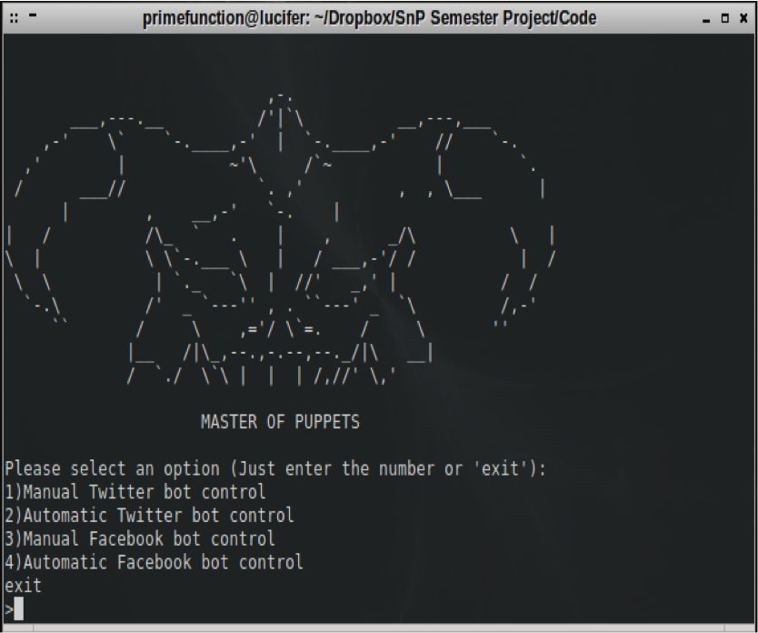

# Mascots, March Madness & #yogapants: Hacking goes to College

Title: Mascots, March Madness & #yogapants: Hacking goes to College
Subtitle:
Primary Author Name: Zack Allen
Primary Author Affiliation: ZeroFOX
Primary Author Email: zack@zerofox.com
Additional Author Name: Chris Cullison
Additional Author Affiliation: ZeroFOX
Additional Author Email: chris@zerofox.com
Additional Author Name: Avi Rubin
Additional Author Affiliation: Johns Hopkins University
Additional Author Email: avirubin@gmail.com
Keywords/Tags: security,socialmedia,impersonation,college,competition
Abstract: 

Professor Rubin gave his students an interesting assignment: conduct red-blue social media-based penetration tests on American universities. Students were tasked to construct an attack, defense and a “cover-your-tracks” plan. Hashtags, fake coffee shops, racy direct messages and yoga pants were just some of the strategies used to direct victims on social media to an emulated attack landing-page. Afterwards, students defended their university’s social media presence from other teams carrying out their attacks. Lastly, they employed concealment techniques to remove the evidence.

The teams switched attack & defense phases after a four-week period. They catalogued their actions with a standardized syslog for analysis, and we calculated the amount of clicks each team generated based on the University IP range. The talk focused on the results of this project, and it outlined some of our favorite team names, strategies and novel project constructions. 

#Introduction & Background

Within the last 10 years, educational institutions have embodied the idea of hacking competitions for their students. The National Cyber Security Defense Competition (NCCDC) [1] holds a yearly national cybersecurity event for college students to apply theories in a real world, hostile cyber-environment. These competitions help students who want to go above and beyond their academic program to put their skills to the test, but it is reserved for elite teams who pass regional qualifiers to compete at the national level. Other exercises include Cyber Defense Exercise who pits service academies against each other [2] and Cyber Patriot, a competition that targets middle to high school students [3].

While there exists a need to test and apply cybersecurity skills in an operational environment or test them given a Capture The Flag (CTF) format, these competitions rarely assess the ability for students to create their own solutions to solve cybersecurity issues. Specifically, these competitions lack opportunities for students to brainstorm, develop and reify implementations that test the security problems both on the offensive and defensive spectrums. This problem offers an opportunity for academia to create innovative and challenging projects for security and computer science classes. This problem inspired the faculty of CS443, a Johns Hopkins University security class, to construct a relevant security project where students where challenged to create and employ offensive and defensive capabilities on social media.

#Project Setup

The faculty chose social media for three reasons. First, social media is an up and coming attack vector for cybersecurity criminal organizations. Phishing attacks on executives[4] and agency accounts [5], DDoS command and control networks [6] [7] [8] and malware campaigns [9] are a sampling of the multitude of attacks that can happen via social media. Due to the implicit trust of having "friends" on these networks, malicious users can abuse these relationships to spread malware, harvest credentials or collect intelligence. Secondly, these websites provide programmatic access to their API, and malicious actors leverage programmatic access to build social botnets capable of spreading attcks. Lastly, Universities social media presence encapsulates multiple bodies of the population that includes professors, sports teams, athletes, notable alumni and campus restaurants. This encapsulation is analogous to businesses that have multiple departments on social media.

Students were given two American universities, one to defend on social media, one as a quarry university. In order to measure the effectiveness of an attack on their respective quarries, a server was setup that measured click traffic based on a team endpoint. Click traffic was chosen as the metric due to the history of attackers on social media using websites as a way to deliver payloads to victims. Actors contact victims via hashtag, direct messages or through impersonating profiles and send out URLs that lead to the attack payload. Once clicked, the victim executes the code and the attacker can gain access to the victim’s machine.

####Metrics & Phases

Instead of a malicious payload, a server was setup that measured click traffic and basic computer, browser and geographic information. For example, Team 1 was setup on http://A.B.C.D/team1/index.html, so if Team 1 was attacking a University, they sent this emulated attack link. When someone clicks it, they visit the team website and receive a "404 not found" page, while the server records one successful click for the team alongside user agents, GEO-IP information, time and device type. 

The project was split up into five phases: setup, attack, defense, cleanup and presentation. The setup phase had students perform reconnaissance for offense and defense to identify entities on social media they could attack or defend in the oncoming phases. It also allowed students time to create their own "social botnet." These botnets interacted with social media APIs to programmatically accept commands and send out links via whatever channel on social media they specified. 

#### Strategies - Attack

Students took turns performing attack and defense against each other. For example, if a team was attacking University A, then a corresponding team was defending it. The project gave students 2 weeks for their respective attack & defense phases. This allowed students to stage campaign style attacks and to also abuse trends on social media to post their attack links.

The attacking students used several strategies to hide their attack URLs. All students use shortlinks to masquerade the end-point of their URLs, while others performed multi-layered approaches. These multi-layered approaches involved a long redirect chain with embedded iframes or obfuscated javascript that led victims to landing pages. These links were spread by their botnets on various social media mediums.

 

Impersonating accounts, or evil twins, were also used in tandem with the link hiding tactics. Impersonation accounts are typically used on social media to act as someone else, whether it is Barack Obama or the CEO of a company, as an effective measure to help build trust with a victim. Through these impersonations, students spread attack URLs so when a potential victim saw the message, they attributed it to a trusted figure. 

For example, during halftime of a college basketball game, one impersonated a local ice cream shop and offered a deal if the home team rallied and won the game in the second half. This attack got retweeted by multiple student and university accounts, yielding 41 clicks.

Another student built a Tinder bot that scoured Tinder for matches. It would automatically "swipe right" on every match, meaning it default accepted any invitation to chat with potential suitors. From this, the student then abused the profile picture and persona he constructed to send users a shortlink to his attack page, stating that he would rather talk on Facebook rather than Tinder.

 

The student group that was targeting University of Michigan (UMich) built a "UMich Jobs" website to lure in victims. This was a combination of a brand abuse and phishing attack that yielded clicks and personally identifiable information (PII) from victims. The group managed to find closed Facebook groups for UMich students and convinced a friend who goes to the university to post on their behalf. This insider attack chained together multiple attack strategies to infect their victims.

#### Strategies - Defense

Methods of defense that students concocted include: hashtag firewalls, shiftwork and bot or not scanners. One team ingested Twitter hashtag streams related to their school and automatically extracted URLs to compare against a blacklist of attack URLs. This hashtag firewall helped them identify hashtag hijacking attempts, where attackers send attack URLs with a hashtag relevant to the target, as shown by the previous college basketball example.

Students also used the ZeroFOX platform to find impersonator profiles. Not only did the platform find impersonator profiles from students, but also real impersonators in the wild.

 

#Results & Conclusion
#### Highest Yield Attacks

Table 1 shows the most successful attack strategies.

Table 1 - Click Distribution

<table>
  <tr>
    <th>Attack</th>
    <th>Networks</th>
    <th>Click Number</th>
  </tr>
  <tr>
    <td>UMich Job</td>
    <td>Facebook</td>
    <td>972</td>
  </tr>
  <tr>
    <td>Tinder Bot</td>
    <td>Tinder</td>
    <td>132</td>
  </tr>
  <tr>
    <td>Fake Attractive Profile </td>
    <td>Twitter</td>
    <td>379</td>
  </tr>
  <tr>
    <td>Fake Attractive Profile</td>
    <td>Facebook</td>
    <td>249</td>
  </tr>
  <tr>
    <td>Fake Coupon/Discount</td>
    <td>Twitter</td>
    <td>367</td>
  </tr>
</table>

Based on the number of clicks and the effective click through rate, students proved the effectiveness of social media as an attack vector for malicious actors. Traditional attack strategies, like phishing and insider attacks, were leveraged and proved successful. We outline the most successful attack strategies by the students as follows:
<ul>
    <li>Targeted Phishing</li>
    <li>Attacking insider forums</li>
    <li>Targeted hashtag attacks</li>
    <li>Brand/Business/University impersonation only</li>
    <li>Human Impersonation</li>
    <li>Spray and pray hashtag hijacking</li>
</ul>

Targeted phishing from the UMich job website was by far most effective strategy. The tactic successfully targeted a specific audience, specifically college students looking for jobs, as a launching platform for clicks. This strategy is not effective in larger scale attacks due to the loss of the targeted nature of the attack.

Insider forums, specifically the closed Facebook groups earned the second most amount of clicks due to the abuse of trust within the groups. This is analogous to clicking on links from an internal email versus a spam email. Users trust communication from trusted sources, which makes this attack effective against an organization where there is a closed community involved.

Targeted hashtags are extremely temporal. Students took advantage of trending hashtags and tried to post their links, but it only caught on in the case of the ice cream post. They attributed this to the nature of Twitter audiences and trends, where there is no guarantee that a post on a trending topic will catch on. 

The last three are a combination of impersonations and spamming hashtags. Some students combined impersonation and hashtag hijacking, while others used a default profile to post attacks against hashtags. The return rate was much lower, yielding a few dozen clicks across four weeks.

#References

[1] http://www.nationalccdc.org/index.php/competition/about-ccdc/mission
[2] https://www.nsa.gov/public_info/press_room/2014/cdx_media_advisory.shtml
[3] http://www.uscyberpatriot.org/
[4] http://www.bloomberg.com/news/articles/2015-02-10/twitter-cfo-anthony-noto-s-account-appears-to-have-been-hacked
[5]
[6] https://nakedsecurity.sophos.com/2012/01/20/anonymous-opmegaupload-ddos-attack/
[7] http://www.theinquirer.net/inquirer/news/2140416/anonymous-twitter-links-cause-ddos-attacks
[8] http://betanews.com/2014/12/26/anonymous-declares-war-on-lizard-squad-after-ddos-attacks-on-game-networks/
[9] http://www.webroot.com/blog/2012/10/19/malware-campaign-spreading-via-facebook-direct-messages-spotted-in-the-wild/
