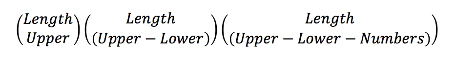

# Tap On, Tap Off: Onscreen Keyboards and Mobile Password Entry

## Abstract: 

Password entry on mobile devices significantly impacts both usability and security, but there is a dearth of usable security research in this area, specifically for complex password entry. To address this research gap, we set out to assign strength metrics to passwords for which we already had usability data, in an effort to have a more meaningful comparison between usability and security. A primary accomplishment of this work is our method of optimizing the input of randomly generated passwords on mobile devices via password permutation. This is done by grouping character classes (i.e., uppercase, lowercase, numbers, symbols) together to minimize the total number of required keystrokes and decrease cognitive load. The number of keystrokes (i.e., taps) saved via permutation depends on the number of onscreen keyboard changes required in the original password rather than on password length. The number of keyboard changes in turn depends on the frequency and placement of symbols and numbers. We propose a method for quantifying effects on entropy resulting from this password permutation. Additionally, we created and are releasing Python scripts (available from  https://github.com/usnistgov/PasswordMetrics) for the experiments on entropy loss we conducted across passwords ranging in length from 5 to 20 characters.  

## Disclaimer

Any mention of commercial products or reference to commercial organizations is for information only; it does not imply recommendation or endorsement by the National Institute of Standards and Technology nor does it imply that the products mentioned are necessarily the best available for the purpose.  

## Introduction

It is the switching back and forth between onscreen keyboards that makes entry of complex, system-generated passwords particularly difficult on mobile devices. To address this issue, we permuted passwords from prior mobile usability research "*Greene, Gallagher, Stanton, & Lee, 2014*"[^1] and calculated the theoretical entropy lost as a result of grouping character classes (i.e., uppercase, lowercase, numbers, symbols) together within a password. By rearranging/grouping the password contents in this way, it reduces the number of keystrokes required to enter the password since the user does not have to continually switch back and forth between three different onscreen keyboards.

 We know unequivocally that for at least one facet of usability (efficiency) permuted passwords are better.

On the other hand, this restructuring of password contents obviously decreases security by adding predictable structure: in the permuted passwords, uppercase letters are always first, followed by lowercase letters, numbers, and finally symbols. 

We argue that only by empirically quantifying the security-usability tradeoff can we hope to measure and understand effects of changing passwords along either or both dimensions. Although alternative—and potentially better—mobile authentication mechanisms exist [e.g., Jakobsson & Akivipat, 2012], the unfortunate reality is that passwords are too deeply ingrained in our current digital world to be fully replaced in the near term. In the longer term, research efforts such as the National Strategy for Trusted Identities in Cyberspace (NSTIC) aim to ultimately replace passwords as a primary authentication mechanism [NSTIC, 2011]. In the interim however, our work is focused on evaluating ways to improve password usability for mobile devices without an unacceptably large sacrifice to security.

## Background
In order to assess both the usability and security of system-generated passwords pre- and post-permutation, it is necessary to first define the relevant metrics for usability and security. 

### Usability Background
Usability is defined [ISO 9241, 1998] as "the extent to which a product can be used by specified users to achieve specified goals with effectiveness, efficiency and satisfaction in a specified context of use." Effectiveness, efficiency, and satisfaction are measurable attributes (each defined in ISO 9241) that combine to form the larger construct of usability. Here we focus on efficiency, defined as the "resources expended in relation to the accuracy and completeness with which users achieve goals." Efficiency is often measured via time on task. In the context of mobile password entry, one can measure password entry time, or number of keystrokes (i.e., taps on the onscreen keyboard). Since it is possible to count taps without collecting human data, we chose to do the latter in the current work. 

### Security Background

There are two password metric groups, classified based on how a password is created: 1) user-generated passwords and 2) system-generated passwords (aka, randomly-generated passwords). It is important to note that password metrics measure only one of these two groups. In our work, we are currently concerned with system-generated passwords similar to those often found in higher-security enterprise environments. To measure our original (i.e., pre-permutation) system-generated passwords, we used the Shannon entropy formula from [NIST SP 800-63-2, 2013].

Where "H" equals the total entropy, "b" equals the number of characters to choose from, and "l" equals password length. Shannon entropy for the original (i.e., non-permuted) 10 passwords are shown below.

### Prior Research

The current work was motivated by a recent behavioral study on mobile password entry for complex, system-generated passwords [Greene, Gallagher, Stanton, & Lee, 2014], which was a replication of a desktop password entry study [Stanton & Greene, 2014]. In both studies, participants had to learn, enter, and recall 10 system-generated passwords; entry times, error frequencies, and recall failures were recorded. Onscreen keyboard switching significantly increased input time and introduced errors. There were over four times as many smartphone errors in the mobile study as in the desktop study (2100 versus 513), emphasizing the effect of device on password usability. In addition to those 10 passwords from prior research, we also used new randomly generated passwords via a program developed in-house (details in Methodology section).

## Current Research

### Methodology

We defined a password permutation in an effort to make randomly generated passwords easier to enter on mobile devices. This was performed by grouping like character categories together in order to minimize the number of times a user must switch back and forth between onscreen keyboards. The permutation categorizes the characters of a password into four sets: uppercase (U), lowercase (L), numbers (N), and symbols (S). The rearranged password is then created by concatenating each set in the order U + L + N + S. We created a Python script to perform the permutation which ensures all characters retain the order in which they were parsed by our tool. We then measured the effects on usability, specifically efficiency as measured by number of keystrokes, and security (for additional details, see [Greene, Kelsey, & Franklin, 2015]). Once our permutation is applied to the original passwords, the Shannon entropy measurement can no longer be used due to the order imposed on the string. Therefore, we defined the entropy loss due to the permutation as equal to:

We ran Monte Carlo simulations to conduct three different entropy loss experiments. All code available online [<https://github.com/usnistgov/PasswordMetrics>].

### Results

#### Usability Results

The number of keystrokes saved—the efficiency gained—via permutation depends on the number of screen depth changes in the original password rather than on the length of the original password per se. The number of screen depth changes in turn depends on the frequency and placement of symbols and numbers, as those are the two character categories that require switching back and forth between onscreen keyboards. In other words, the more symbols there are and the more intermixed they are with other character classes in the original password, the more screen depth changes that will be saved via permutation.

#### Security Results: Experiment 1, Fan-Out
It is possible for multiple unique passwords to permute to the same password, thus our calculations must take into account the issue of password collisions like these:

In our first experiment, we asked: how many passwords collide with the same user-friendly password?

#### Security Results: Experiment 2, Entropy Loss
In our second experiment, we asked: how much entropy is lost by permuting passwords?

#### Security Results: Experiment 3, All-Lowercase
In our third experiment, we asked: how much additional password length would we need to just change over to all lowercase letters? 

## Conclusions

Entering complex passwords on mobile devices is difficult due to constraints of onscreen keyboards, in particular, the fact that entering numbers and symbols requires switching back and forth between different onscreen keyboards. Our password permutation helps mitigate this usability issue, making it more efficient (i.e., requiring fewer taps) to enter complex, system-generated passwords on mobile devices. We measured the security loss due to our password permutation, and addressed the loss by adding additional lowercase letters.  

The fact that passwords containing numbers and symbols require changing onscreen keyboards is a fundamental difference between desktop and mobile platforms, yet it does not appear that current password policies have taken this fundamental difference into account. The effects that mobile device constraints have on both usability and security of passwords need to be systematically explored and measured in order to better inform password policies for the increasingly mobile work environment. With the current research, we have accomplished an initial piece of such systematic exploration. 

## References

* [^1] [Greene, Gallagher, Stanton, & Lee, 2014] I Can't Type That! P@$$w0rd Entry on Mobile Devices. In Human Aspects of Information Security, Privacy, and Trust, Lecture Notes in Computer Science Volume 8533, pp 160-171.
* [^2] [Greene, Kelsey, & Franklin, 2015] Measuring the Usability and Security of Permuted Passwords on Mobile Platforms. National Institute of Standards and Technology Interagency Report 8040.
* [^3] [ISO 9241, 1998] ISO 9241-11. Ergonomic requirements for office work with visual display terminals (VDTs) -- Part 11: Guidance on usability.
* [^4] [Jakobsson & Akivipat, 2012] Rethinking Passwords to Adapt to Constrained Keyboards. In Proceedings of Mobile Security Technologies. http://www.markus-jakobsson.com/fastwords.pdf
* [^5] [NIST SP 800-63-2, 2013] Burr et al, Electronic Authentication Guideline, National Institute of Standards and Technology Special Publication. 
* [^6] [NSTIC, 2011] National Strategy for Trusted Identities in Cyberspace. Enhancing Online choice, Efficiency, Security, and Privacy. http://www.whitehouse.gov/sites/default/files/rss_viewer/NSTICstrategy)041511.pdf
* [^7] [Stanton & Greene, 2014] Character Strings, Memory and Passwords: What a Recall Study Can Tell Us. In Human Aspects of Information, Security, Privacy, and Trust. Lecture Notes in Computer Science, Vol. 8533, pp 195-206. 

#### Metadata

Tags: usable security, authentication, metrology, password permutation, password generation

**Primary Author Name**: Kristen K. Greene  
**Primary Author Affiliation**: National Institute of Standards and Technology  
**Primary Author Email**: kristen.greene@nist.gov  

**Additional Author Name**: Joshua Franklin  
**Additional Author Affiliation**: National Institute of Standards and Technology  
**Additional Author Email**: joshua.franklin@nist.gov  

**Additional Author Name**: John Kelsey  
**Additional Author Affiliation**: National Institute of Standards and Technology  
**Additional Author Email**: john.kelsey@nist.gov  

