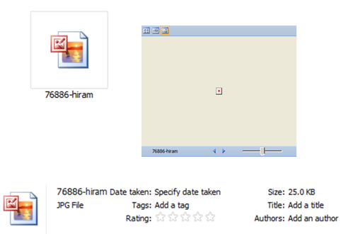

# Don't Look Now! Malicious Image Spam

## Abstract: 

A picture is worth a thousand words. It also contains malware and other interesting items if one looks past the wavy words, pills, sailboats and pornography. Working with a corpus of roughly 400,000 spam images, students at The University of Akron have helped categorize the images, perform steganalysis, and extract malware. This paper presents a view of the corpus and things found lurking in the wild.

## Ham versus Spam

A picture is worth a thousand headaches when it comes in the form of spam. The content is usually malicious whether it contains phishing links, pornography, or markets fake pharmaceuticals and retail goods. Modern spam filters are very good at identifying this nuisance yet spam still performs the ritual daily assault on our inboxes. The Spammer’s Compendium [^2] is an excellent resource of information on different techniques spammers use to avoid detection. This paper specifically looks at image spam.  

Image spam is either embedded into the body of a message or sent as an attachment. This filter avoiding tactic first appeared around 2000 but was not considered much of a threat. By 2005 it accounted for a mere 1% of spam emails. Within 18 months however, images such as that in Figure 1 populated over 21% of email spam[^1]. It’s a relatively effective mode of content delivery because digital manipulations make it difficult for OCR readers to catch, and with minor changes, fingerprinting (ex., via MD5 hashes) is virtually impossible. 

| **OCR detectable** | **OCR defeatable** |
|:------:|:-----:|
|  |  |
**Figure 1. Image spam generated to bypass spam filters.**

In 2007, a coworker became intrigued by image spam and the possibility of training an artificial neural network to differentiate between spam and ham, with spam being defined as a computer generated image and ham being identified as a photograph, illustrated in **Figure 2**.  We collected images from our personal inboxes and those of willing family and friends to create a small corpus of spam. Ham was generated from our cameras. Using a free version of FANN[^3], we trained and tested the artificial neural network. Playing with different variables such as hidden neurons, we reached an 89% success rate identifying spam and 90% success rate with ham. This was with a corpus of 2000 spam and 1000 ham images[^4]. Smaller corpuses in earlier work[^5] did not reveal as good results as one would expect.  The larger corpus is credited to Robert Bruen of Knujon who supplied spam images stripped from emails nightly from about April 2008 through March 2014[^6]. 

| **SPAM** | **HAM** |
|:------:|:-----:|
|  |  |  
**Figure 2. Image spam versus ham.**

The size of the corpus without duplicates by February 2011 was 215,799 images. We estimate it to be around 400,000 today. During different semesters teaching Computer Security at The University of Akron, I’ve assigned “in the wild” projects for both graduate and undergraduate students. The following sections summarize what we found in the corpus over time through various class and master’s projects.
## What are We Looking At? ##
Spammers tend to run with the season. While many retailers are shelving Christmas wreaths alongside Halloween costumes, spammers wait until December to send Christmas images. January brings tidings of exercise equipment and February delivers chocolate and flowers to your inbox as in Figure 3. Pharmaceutical, financial, retail, gambling and software images are pervasive and appear with regularity year round.

  
**Figure 3. Seasonal image spam.**

Sexually oriented images are dominated by pictures of women in various stages of clothing. Male images were common during the spring and summer of 2010 but haven’t appeared much since then. The percentage of hard core pornography is actually very low. This is considered to be a monetary commodity to be purchased. Because these images are stored on our server, we attempt to keep it as secure as possible to prevent a minor from hacking into it. 

Several other, unexpected categories surfaced. In early 2010, we saw our first animal cruelty pictures and also our first “hate” images. These were particularly disturbing to look at. The politically motivated hate images first appeared in October 2010 and continued through January 2011. To date, only a small number have appeared in the corpus, but the timing may not be coincidental to the unrest, protests, and ensuing violence that marked world events in January and February 2011.

Hardest to deal with were several “soft” child porn images found in March 2011 and about a dozen potential human trafficking images discovered in fall 2011. The questionable images were of two Japanese children, fully clothed, in various positions ranging from mildly uncomfortable to completely inappropriate but inspection by a specialist with the City of Akron Police Department confirmed that there was nothing legal to pursue. 

## Don’t rename that file!

Manual inspection of images shows that spammers try to prevent inspection of image content by scraping the header part of the image. This renders the image unreadable by a file reader although it does open using a picture editor. The technique makes it possible to successfully convey the intended message to the user but prevents processing the image. **Figure 4** shows a few examples of these images found in our corpus. 

  
**Figure 4. Scraped images.**

At first I only read about using image spam to spread malware and it seemed farfetched. Then I began inspecting the corpus with a different intent, finding my own malicious images in the wild. This included one with embedded malware that wasn’t listed on the malware registry sites for three days after it appeared in the corpus. The first technique we saw is easily detected by anti-malware once the malware has been identified and added to the update list of malware detection programs. A file is simply named something like `795-IMG_20131001_76475.jpg.exe`. This is easily detectable by someone with knowledge about computers but not so much when the default settings are to hide the extension and someone unfamiliar with file systems sees `795-IMG_20131001_76475.jpg` and assumes it’s an image. It’s not an effective technique otherwise, as even the default icon is different from the jpg icon. However, criminals dispersing these files are counting on uneducated users to click on the images to open them. 

Embedding malware in files is not a new concept. It is used with MP3 files, video files, text documents and others. In general, when a non-executable file such as a jpeg containing an executable is double clicked, the non-executable file is opened by its associated application. You view the jpeg as a picture and nothing happens with the embedded malware. This presumes that the host machine is already infected and that another component, a loader, is present. The loader extracts the code from the jpeg (or other image) and runs it. Typically, this works because the component on the infected machine downloads the image from the web. In our case, these images came wrapped in spam, so we are certain that the complimentary portion of the malware infection was not present. We did perform some basic reverse engineering, noting that the loader was not present.

**Figures 5 and 6** shows another interesting tactic via a file that appears to be corrupt. The file size is greater than zero but an image viewer cannot open it. However, if you unzip it, you find a folder inside, and inside the folder is malware.

  
**Figure 5. Suspicious file with apparently no content**

  
**Figure 6. Uncompressed jpg file reveals folder with an executable inside.**

## The Enigmatic Sailboat

One can lose focus looking at tens of thousands of spam images. One evening, I was staring at a sailboat image, trying to figure out the context since the images delivered by Knujon do not come with the original emails. It occurred to me that steganography might be involved so decided to create a class project. Students downloaded various free and popular steganalysis and steganography tools from the Internet. I gave them a set of images from my corpus and had them test it. StegSecret identified steganography techniques from an older version of Outguess and JPHide. One image that was identified as possibly containing steganography is `10786-NatalyaIm-34.jpg`, shown in **Figure 7**. 

  
**Figure 7. 10786-NatalyaIm-34.jpg**

Outguess confirmed that it could open the file if a password was provided. After trying the obvious passwords, including the filename, the word “Natalyalm” succeeded in producing the 509 bytes in **Figure 8**. I suspect this is a key that can be used to open another file holding information that I would not likely want to see. 

  
*Hidden data in ASCII*

  
*Partial hex dump of hidden data*

**Figure 8. Hidden data in 10786-NatalyaIm-34.jpg**

## References

* [^1] J. Swartz, “Picture this: A sneakier kind of spam,” USA Today, Jul. 23, 2006.
* [^2] Spammer’s Compendium,
https://www.virusbtn.com/resources/spammerscompendium/index, last accessed January 2015.
* [^3] Fast Artificial Neural Network Library, http://leenissen.dk/fann/, last accessed January 2015.
* [^4] Artificial Neural Networks as a Tool for Identifying Image Spam, Hope, P., Bowling, J. R., and Liszka, K. J., The 2009 International Conference on Security and Management (SAM'09), July 2009, pp. 447-451.
* [^5] Spam Image Identification Using an Artificial Neural Network, Bowling, J. R., Hope, P., and Liszka, K. J., Proceedings of the 2008 MIT Spam Conference, Cambridge, Massachusetts, March 2008.
* [^6] KnujOn, http://www.knujon.com/, last accessed January 2015.

#### Metadata

Tags: image spam, malware, steganography

**Primary Author Name**: Kathy J. Liszka
**Primary Author Affiliation**: The University of Akron
**Primary Author Email**: liszka@uakron.edu